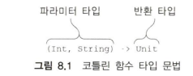
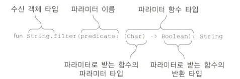

# 8.1 고차 함수 정의

<aside>

## 8.1.1 함수 타입

- 함수도 변수에 저장 가능하고, 함수의 인자나 반환값으로 사용가능함. 이러 함수를 표현하는 타입을 **함수 타입** 이라고 함

- 코틀린의 **타입 추론**으로 인해 변수 타입을 **지정하지 않아도** 람다를 변수에 대입 가능
    
    ```kotlin
    val sum = { x: Int, y: Int -> x + y } // 타입 생략(자동 추론)
    val action = { println(42) }
    ```
    

- 각 변수에 구체적인 타입 선언을 추가한 경우 (명시적 타입 선언)
    
    ```kotlin
    val sum: (Int, Int) -> Int = { x, y -> x + y }
    val action: () -> Unit = { print(42) }
    ```
    
    
    
    - `Unit` 타입 : 의미 있는 값을 반환하지 않는 함수 반환 타입
    - 변수 타입을 함수 타입으로 지정하면 함수 타입에 있는 파라미터로부터 람다의 파리미터 타입 유추 가능
        
        → 따라서 람다 식 안에서 굳이 파라미터 타입을 적을 필요 없음
        
- 다른 함수와 마찬가지로 함수 타입에서도 반환 타입을 **널이 될 수 있는 타입**으로 지정 가능
    
    ```kotlin
    var canReturnNull: (Int, Int) -> Int? = {x, y => null}
    ```
    
- 널이 될 수 있는 함수 타입 변수도 정의 가능. 다만 함수의 반환 타입이 아니라 함수 타입 전체가  널이 될 수 있는 타입임을 선언하기 위해 함수 타입을 괄호로 감싸고 그 뒤에 **물음표**를 붙여야 함
    
    ```kotlin
    var funOrNull: ((Int, Int) -> Int)? = Null
    ```
    
</aside>

<aside>

## 8.1.2 인자로 받은 함수 호출

- 간단한 고차 함수 정의하기

```kotlin
fun twoAndThree (operation: (Int, Int) -> Int) { // 함수 타입인 파라미터를 **선언**

	val result = operation (2, 3) // 함수 타입인 파라미터 **호출**

	println("The result is $result")
	
}

twoAndThree { a, b -> a + b } // The result is 5

twoAndThree { a, b -> a * b } // The result is 6
```

- **람다를 인자로 전달하면**, 그 람다를 마치 일반 함수처럼 호출 가능

- 술어 함수를 파라미터로 받는 filter 함수 정의
    
    
    

- 문자열의 각 문자를 조건에 맞게 필터링하는 고차 함수 예시
    
    ```kotlin
    fun String.filter(predicate: (Char) -> Boolean): String {
        val sb = StringBuilder()
        for (char in this) {
            if (predicate(char)) sb.append(char)
        }
        return sb.toString()
    }
    
    ```
    
    ```kotlin
    println("ab1c".filter { it in 'a'..'z' }) // abc
    ```
    
    → `filter` 함수를 단순하게 만든 버전 구현
    
</aside>

<aside>

## 8.1.3 자바에서 코틀린 함수 타입 사용

- 코틀린의 함수 타입 → 바이트코드에서는 `FunctionN` 인터페이스로 변환됨
    - 예시: `(Int) -> Int` → `Function1<Int, Int>`
    - 내부적으로 `invoke()` 메소드가 있음 → 이걸 호출하면 함수 실행됨

- 함수 타입을 사용하는 코틀린 함수를 자바에서도 쉽게 호출 가능. 자바 8 람다를 넘기면 자동으로 함수 타입의 값으로 변환

```kotlin
fun processTheAnswer(f: (Int) -> Int) {
    println(f(42))
}
```

```java
processTheAnswer(number -> number + 1); // 43
```

- 자바 8 이전의 자바에서는 필요한 `FunctionN` 인터페이스의 `invoke` 메소드를 구현하는 무명 클래스를 넘기면 됨
    
    → 코틀린 함수 타입을 자바에서 사용할 수 있지만, 자바 8 이전에는 코드가 좀 복잡함.
    

```java
processTheAnswer(new Function1<Integer, Integer>() {
    @Override
    public Integer invoke(Integer number) {
        return number + 1;
    }
});

```

<자바에서 코틀린 **확장 함수** 사용>

```java
List<String> strings = new ArrayList<>();
strings.add("42");

CollectionsKt.forEach(strings, s -> {
    System.out.println(s);
    return Unit.INSTANCE; // Unit 반환 필요
});

```

- `Unit`은 자바에선 반환값이 있기 때문에 **명시적으로 `Unit.INSTANCE`를 반환**해야 함
- `String -> Unit` 타입 자리에 자바의 `void` 리턴 람다는 사용 불가
</aside>

<aside>

## 8.1.4 디폴트 값을 지정한 함수 타입 파라미터나 널이 될 수 있는 함수 타입 파라미터

- 함수 타입에도 디폴트 값을 줄 수 있음
    
    ```kotlin
    fun <T> Collection<T>.joinToString(
        separator: String = ", ",
        prefix: String = "",
        postfix: String = ""
    ): String {
        val result = StringBuilder(prefix)
        for ((index, element) in this.withIndex()) {
            if (index > 0) result.append(separator)
            result.append(element)  // toString() 사용
        }
        result.append(postfix)
        return result.toString()
    }
    
    ```
    
    - 이 구현은 유연하지만 핵심 요소 하나를 제어할 수 없다는 단점이 존재
    - 그 핵심 요소는 바로 컬렉션의 각 원소를 문자열로 변환하는 방법
    - 코드는 `StringBuilder.append(o:Any?)`를 사용하는데, 이 함수는 항상 객체를 `toString` 메소드를 통해 문자열로 바꿈
    
    → 이는 함수 타입의 파라미터에 대한 디폴트 값을 지정하면 이런 문제를 해결 가능. 디폴트 값으로 람다 식을 넣으면 됨
    

- 함수 타입의 파라미터에 대한 디폴트 값 지정하기
    
    ```kotlin
    fun <T> Collection<T>.joinToString(
        separator: String = ", ",
        prefix: String = "",
        postfix: String = "",
        transform: (T) -> String = { it.toString() } // 함수 타입 파라미터에 디폴트 람다!
    ): String {
        val result = StringBuilder(prefix)
        for ((index, element) in this.withIndex()) {
            if (index > 0) result.append(separator)
            result.append(transform(element)) // 이 부분이 유연해짐
        }
        result.append(postfix)
        return result.toString()
    }
    
    ```
    
    ```kotlin
    val letters = listOf("Alpha", "Beta")
    
    println(letters.joinToString()) 
    // Alpha, Beta (기본 transform 사용)
    
    println(letters.joinToString { it.lowercase() }) 
    // alpha, beta (람다 전달)
    
    println(letters.joinToString(separator = "! ", postfix = "!", transform = { it.uppercase() })) 
    // ALPHA! BETA!
    
    ```
    

- 함수 타입에 대한 디폴트 값을 선언할 때 특별한 구문이 필요하지 않음
- 다른 디폴트 파라미터 값과 마찬가지로 함수 타입에 대한 디폴트 값 선언도 `=` 뒤에 람다를 넣으면 됨

### 널이 될 수 있는 함수 타입

- 함수 타입도 `nullable`로 선언할 수 있음
- 단, 호출 시 `null` 체크를 **반드시** 해야 함
</aside>

<aside>

## 8.1.5 함수를 함수에서 반환

- 함수가 **함수를 반환할 필요**가 있는 경우보다는 함수가 **함수를 인자로 받아야 할 필요**가 있는 경우가 훨씬 더 많음
- 함수를 반환하려면 return 식에 람다나 멤버 참조나 함수 타입의 값을 계산하는 식 등을 넣으면 됨
</aside>

<aside>

## 8.1.6 람다를 활용한 중복 제거

- 코드 중복을 줄일 때 함수 타입이 상당히 도움이 됨
- 코드의 일부분을 복사해 붙여 넣고 싶은 경우가 있다면 그 코드를 **람다**로 만들면 **중복 제거 가능**
- 변수, 프로퍼티, 파라미터 등을 사용해 데이터의 중복을 없앨 수 있는 것처럼 람다를 사용하면 코드의 중복을 없앨 수 있음
- (결론)
    - 프로그램을 작성하다 보면 비슷한 구조의 코드가 여러 번 반복될 때가 있음
    - 이때 반복되는 **행동(로직)**만 **람다**로 뽑아내면, 중복 없이 재사용 가능한 구조로 만들 수 있어.
    - 마치 중복되는 데이터를 변수로 빼는 것처럼, **중복되는 로직은 람다로 빼는 것**이 핵심.
    - 예시) 공통 작업 시간 측정
    
    ```kotlin
    inline fun <T> logExecutionTime(taskName: String, block: () -> T): T {
        val start = System.currentTimeMillis()
        val result = block()
        val end = System.currentTimeMillis()
        println("$taskName took ${end - start} ms")
        return result
    }
    
    ```
    
    ```kotlin
    logExecutionTime("데이터 처리") {
        processData()
    }
    
    logExecutionTime("네트워크 요청") {
        fetchFromNetwork()
    }
    
    ```
    
</aside>